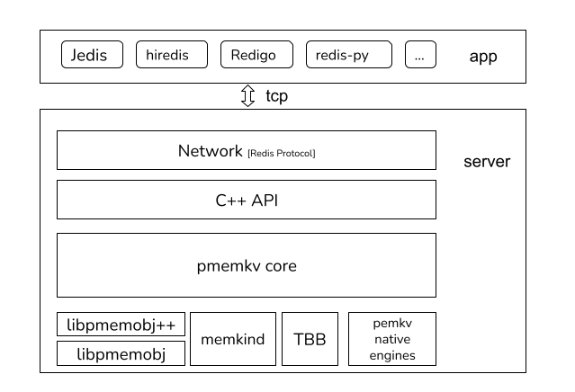

### 介绍
这个版本的 pmemkv 支持了兼容部分 redis 协议的网络层，您可以用它来做跨语言的数据交互，可以将 pmemkv 作为远程实例使用。



### 快速上手

- build docker 镜像
```
make image
```

- 编译代码
```
make build
```

- 运行 pmemkv_redis

```
make run
```

- 读写 (在宿主机执行，容器和宿主机网络已通)

```
redis-cli -h 127.0.0.1 -p 6379
```

### 目前支持的命令列表
- get
- set
- scan
- del
